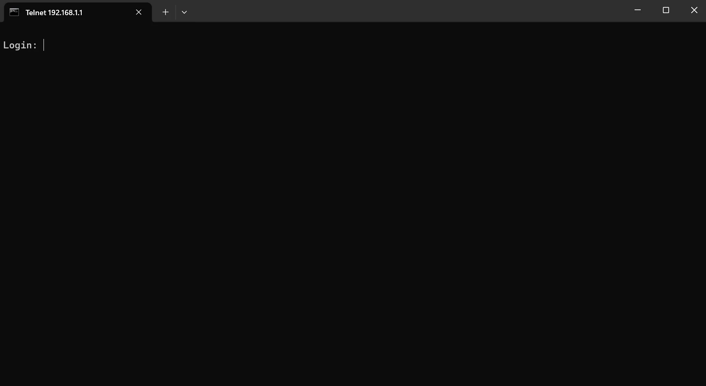
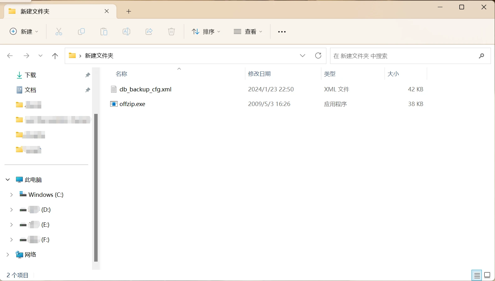
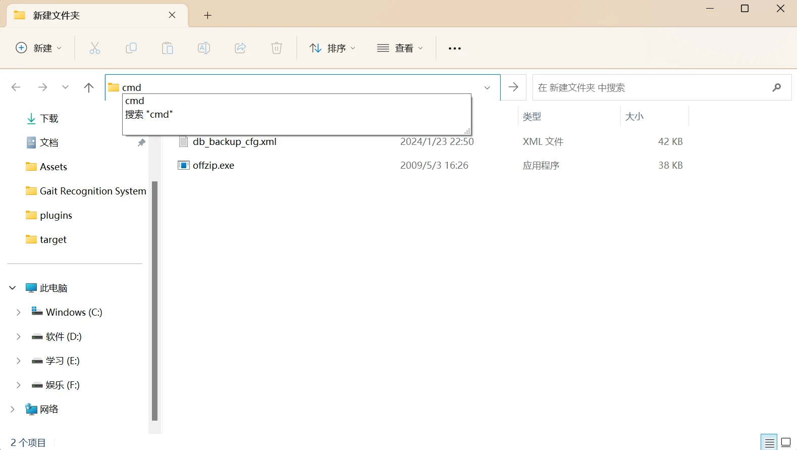
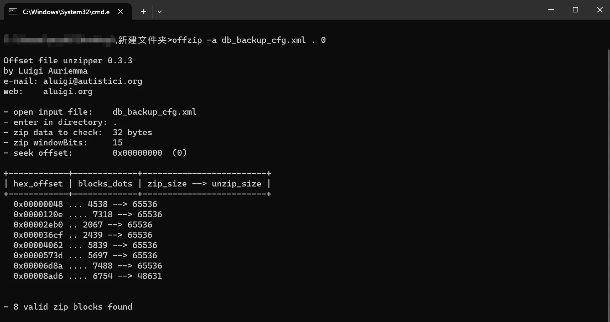
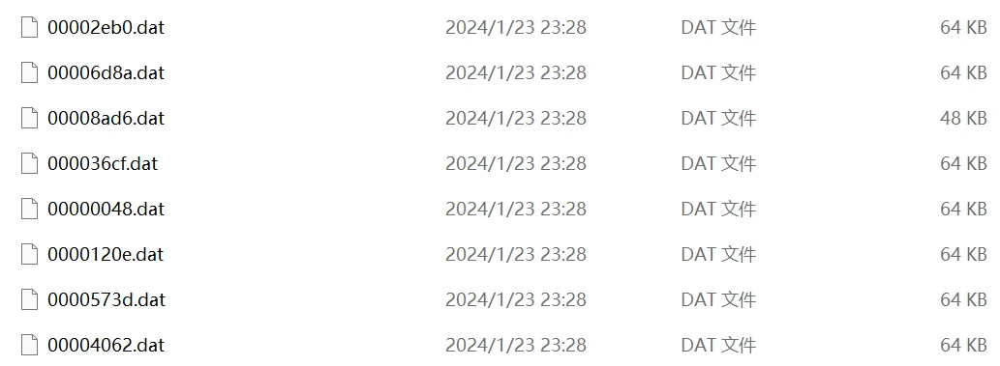
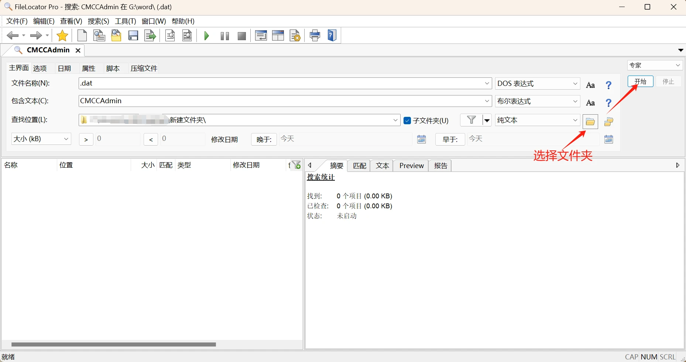
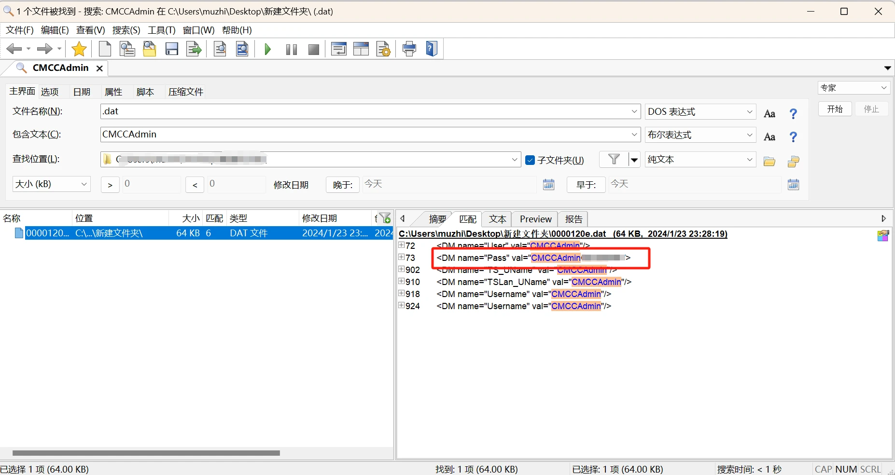

> ⚠️ **免责声明**：本教程仅适用于 GM220S 型号光猫，其他型号仅供参考。对于操作不当导致光猫出现故障，教程作者概不负责。 本教程仅供学习和研究使用，请勿用于非法用途。

## 🔍 背景

当我们在尝试通过超级管理员进入配置的时候，按照网上的教程输入：

- **用户名**：`CMCCAdmin`
- **密码**：`aDm8H%MdA`

发现 😅 **密码错误**——装宽带的师傅显然修改了密码。这时候如何获取真正密码呢？下面一步步教你。

---

## 📋 操作步骤

### 第一步：打开 Telnet 🔓

1. 打开 `http://192.168.1.1` 登录你的用户管理页面（账号密码在路由器背面）
   - 账号是 `user`，密码要记住，后面要用到

2. 接着打开这个网址：
   ```
   http://192.168.1.1/getpage.gch?pid=1002&nextpage=tele_sec_tserver_t.gch
   ```

3. ✅ **勾选「打开 LAN_Telnet」**，点击确定
   - 点了确定之后也许网页刷新了一下，什么都没有发生——这是正常的，继续下一步即可

### 第二步：插入 U 盘 💾

找一个 U 盘插入到 GM220S 的 USB 接口上。

### 第三步：连接到 Telnet 🖥️

打开 **cmd**（方法：任务栏 Windows 徽标上右击 → 终端/命令提示符），输入：

```bash
telnet 192.168.1.1
```

- ✅ **如果提示输入用户名和密码** —— Telnet 打开成功 🎉（如下图）
  

- ❌ **如果提示 `telnet` 不是内部或外部命令** —— 请打开「程序与功能 → 启动或关闭 Windows 功能」，勾选 **Telnet 客户端**

- ❌ **如果提示连接失败** —— 说明 Telnet 可能没有打开，请重复第一步

**登录 Telnet：**

- **账号**：`CMCCAdmin`
- **密码**：`光猫后面 user 的密码 + @C1`

没有提示密码错误，说明成功连接 ✅

连接后可以输入 `ls`（小写 L 不是 1）回车，会展示出目录结构 📂

### 第四步：拷贝配置文件到 U 盘 📤

先确认 U 盘已经插入，然后运行：

```bash
cp /userconfig/cfg/db_backup_cfg.xml /mnt/usb1_1
```

之后就可以拔出 U 盘了 ✅

### 第五步：密码获取 🔑

1. 把 U 盘插入电脑，确认根目录下有 `db_backup_cfg.xml` —— 没有则重复第四步

2. 找个地方创建一个**空文件夹**，把上述文件拷贝进去

3. 下载 [offzip](https://www.123pan.com/s/uksRVv-tvPh)（提取码：`uocD`），将 `offzip.exe` 放在该文件夹（如下图）
   

4. 在文件夹路径栏里输入 `cmd` 并回车（如下图）
   

5. 在弹出的命令提示符窗口中运行：
   ```bash
   offzip -a db_backup_cfg.xml . 0
   ```
   

6. 出现上图即为成功 ✅ 可以看到文件夹里多了一堆 `.dat` 文件
   

7. 接下来下载安装 **FileLocatorPro**（下载地址见结尾），打开后按下图输入
   

8. 点击开始后，你会看到：
   

9. 🎉 **Pass 这一栏就是超级管理员密码！** 打开 `http://192.168.1.1` 登录，大功告成！

---

## 📥 资源下载

| 资源 | 链接 |
|------|------|
| offzip 及相关工具 | [123云盘下载](https://www.123pan.com/s/uksRVv-tvPh)（提取码：`uocD`） |
| 参考视频 | BV18d4y1P7kH（部分优化） |

> 💡 *如果对你有帮助，记得支持一下我哦~*

