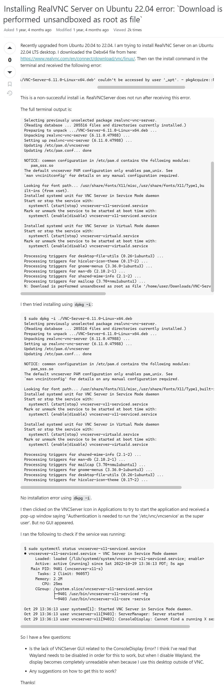
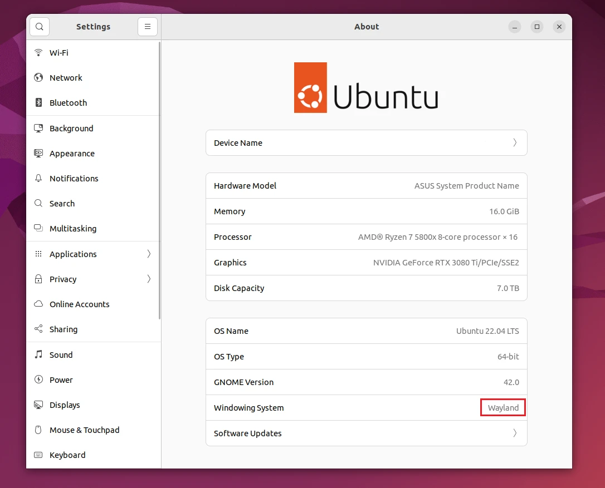

## 🎯 背景

前几天买了个树莓派 🍓，装上了 **Ubuntu 22.04** 系统。为了方便远程控制，安装了 **Todesk**。安装一切正常，但在连接的时候——

😱 **电脑端进度卡在 100%**，而 Ubuntu 上却显示已连接成功。

不知所措之下，又装了 **RealVNC Server**，结果不显示 UI，安装时还报错。经过一番捣鼓后终于找到问题根源，特此分享 📝

---

## ❌ 遇到的问题

### 1️⃣ Todesk — 连接卡在 100%

连接服务器时，进度始终卡在 **100%**，但是被控端显示正常被连接。


> *由于复原比较麻烦，图是 P 的，但大概就是这么个事儿 😅*

### 2️⃣ Real VNC Server — 安装后不显示 UI

安装时遇到以下输出：

```
NOTICE: common configuration in /etc/pam.d contains the following modules:
   pam_sss.so
The default vncserver PAM configuration only enables pam_unix. See
`man vncinitconfig` for details on any manual configuration required.

Looking for font path... /usr/share/fonts/X11/misc,/usr/share/fonts/X11/Type1,bu
ilt-ins (from xset).
Installed systemd unit for VNC Server in Service Mode daemon
Start or stop the service with:
  systemctl (start|stop) vncserver-x11-serviced.service
Mark or unmark the service to be started at boot time with:
  systemctl (enable|disable) vncserver-x11-serviced.service

Installed systemd unit for VNC Server in Virtual Mode daemon
Start or stop the service with:
  systemctl (start|stop) vncserver-virtuald.service
Mark or unmark the service to be started at boot time with:
  systemctl (enable|disable) vncserver-virtuald.service
```

安装是正常安装了 ✅ 但是点击图标时，要输入管理员认证，认证之后**就没有任何 UI 显示**。就像这个链接里描述的那样：

🔗 https://superuser.com/questions/1750182/installing-realvnc-server-on-ubuntu-22-04-error-download-is-performed-unsandbo

（虽然估计你打不开，丢一张网站截图在这里 👇）


---

## ✅ 解决方案

> 🧠 **根本原因**：截止发文时间，Todesk 只支持 **X11 协议**，没有适配最新的 **Wayland 协议**。所以我们需要把窗口系统调整为 X11。



### Step 1 ✏️ 修改配置文件，关闭 Wayland

```bash
sudo nano /etc/gdm3/custom.conf
```

### Step 2 🔧 取消注释

找到以下这行，把前面的 `#` 号删掉：

```
#WaylandEnable=false
```

⬇️ 改为：

```
WaylandEnable=false
```


### Step 3 💾 保存退出

按 `Ctrl + X` 离开，提示是否保存时输入 `Y` 回车保存。

### Step 4 🔄 重启系统

```bash
reboot
```

🎉 **重启完成，以上两个问题都被解决！**

---

## 💡 总结

所以说如果你的 Todesk 进度也卡在了 **100%**，十有八九是因为**图传的问题**（比如解码编码出了状况），而根源就是 **Wayland 与 X11 的不兼容**。

---

## 📖 附 1：背景知识 — X11 与 Wayland 区别

| 维度 | X11 | Wayland |
|------|-----|---------|
| 🏗️ **架构** | 客户端-服务器架构，应用通过 X 服务器与显示器交互 | 合成器-客户端架构，应用直接与合成器交互 |
| ⚡ **性能** | 输出需多次复制转换，性能较低 | 输出直接传递给合成器，性能更优 |
| 🔒 **安全性** | 应用可访问整个 X 服务器（含其他应用数据） | 沙箱隔离，每个应用只能访问自己的数据 |
| 🔄 **兼容性** | 非常成熟，已被广泛使用几十年 | 部分旧应用不兼容（可通过 XWayland 兼容层运行） |
| 🛠️ **开发难度** | 高级抽象层，开发较简单 | 需要处理更多细节（窗口管理、输入事件等） |

---

## 📚 附 2：参考资料

- [https://blog.csdn.net/benco1986/article/details/131372561](https://blog.csdn.net/benco1986/article/details/131372561)
- [https://blog.csdn.net/crazyjinks/article/details/130017180](https://blog.csdn.net/crazyjinks/article/details/130017180)
- [https://www.tuxedocomputers.com/en/Whats-the-deal-with-X11-and-Wayland-_1.tuxedo](https://www.tuxedocomputers.com/en/Whats-the-deal-with-X11-and-Wayland-_1.tuxedo)
