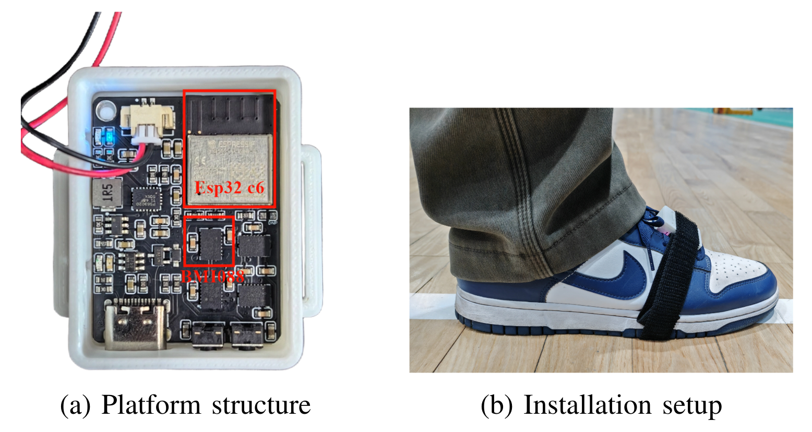
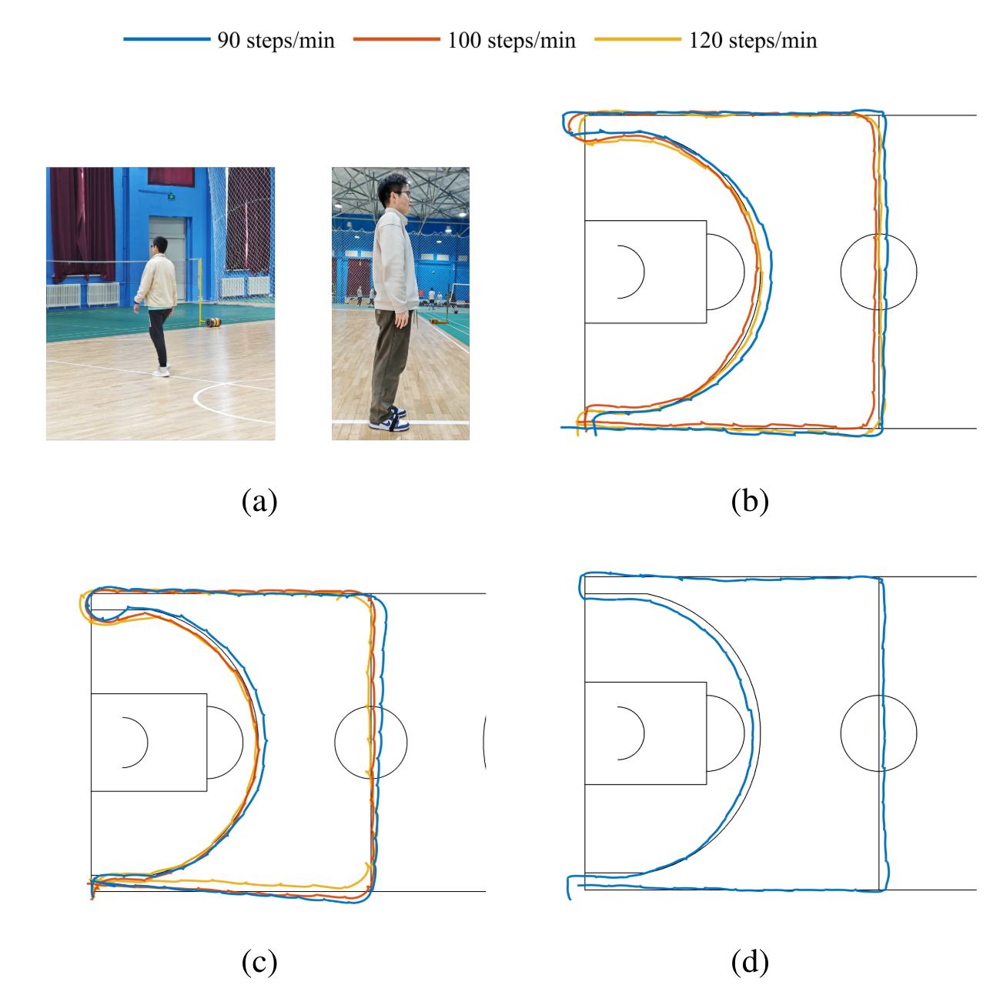
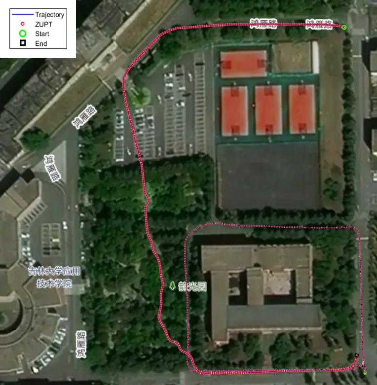

:::note
📄 **IEEE Paper**: [Strictly Real-Time and Lightweight Foot Mounted Inertial Navigation via Residual Energy and Angular Motion Fusion](https://ieeexplore.ieee.org/) (IEEE Conference, 2026)
:::

To validate the feasibility of the proposed method on a low-cost embedded platform, a foot-mounted inertial navigation system was developed based on an **ESP32-C6 (160 MHz)** and a **BMI088 six-axis IMU**. The IMU is fixed on the instep of the shoe — this mounting configuration ensures wearing convenience while enhancing the rigid coupling between the sensor and the shoe, thereby improving the stability of zero-velocity updates.

**Two key challenges** are addressed. First, zero-velocity detection is sensitive to gait variations — our **fusion-based detector** combines **residual energy** (capturing foot-contact transitions via short-term acceleration/angular velocity residuals) with a **low-frequency angular motion envelope** (preserving gait periodicity). A **soft-normalization compression** stabilizes decisions under large dynamic range without introducing long latency.

Second, conventional INS suffers from drift and delayed output. We construct a **six-state Unscented Kalman Filter (UKF)** that models the **composite additive acceleration error** directly in the navigation frame, enabling continuous propagation with conditional ZUPT corrections at low computational cost. A **one-frame-in/one-state-out mechanism** ensures strictly real-time output — the state with timestamp $k$ is published within the same processing cycle, even during swing phases.

Indoor experiments were conducted on a **standard half basketball court** (approximately **15 m × 14 m**). Two subjects performed repeated closed-loop walking under metronome guidance at step frequencies of **90, 100, and 120 steps/min** to evaluate adaptability to different gait speeds and individuals — results for different step frequencies are illustrated by curves of different colors.

In addition, a continuously varying step-frequency experiment from **90 to 120 steps/min** was conducted to evaluate detector stability under dynamically changing gait rhythms.

To further validate applicability over longer paths, an **outdoor long-distance walking experiment** was conducted. The system maintained stable trajectory propagation and periodic error suppression during extended walking, demonstrating its capability for continuous navigation in practical scenarios.

To highlight the engineering significance of the strictly real-time output, the proposed **one-frame-in/one-state-out mechanism** was compared with a conventional delayed-publishing baseline that updates the state only after the supporting foot is confirmed. The results show that the proposed method continuously outputs the current state at every IMU sampling instant, with errors exhibiting bounded continuous fluctuations over time. In contrast, the delayed-publishing baseline shows noticeable stepwise outputs and larger instantaneous lag — demonstrating that the improvements are reflected not only in endpoint accuracy but also in **state freshness and temporal alignment**.

The method achieves **stable positioning**, **continuous low-latency outputs**, and **good trajectory repeatability** across indoor and outdoor scenarios — providing a practical real-time inertial solution for wearable pedestrian navigation.

:::note
📄 **Paper**: [Strictly Real-Time and Lightweight Foot Mounted Inertial Navigation via Residual Energy and Angular Motion Fusion](https://ieeexplore.ieee.org/) — IEEE Conference, 2026
:::