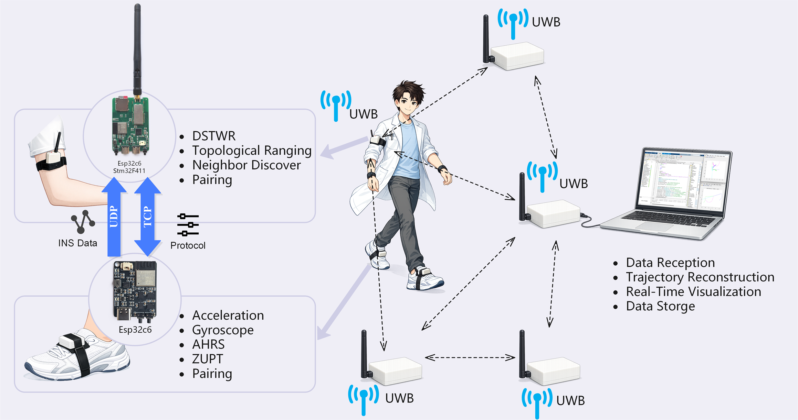
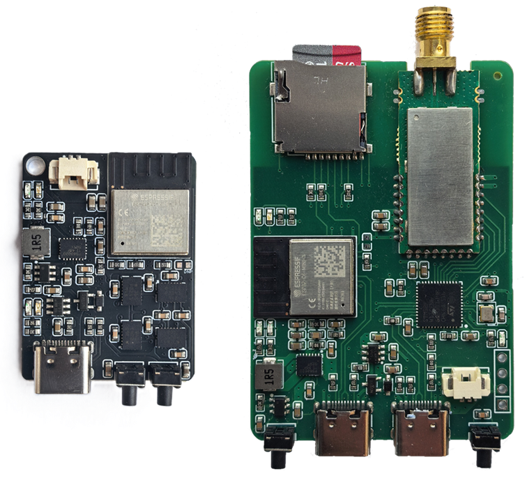
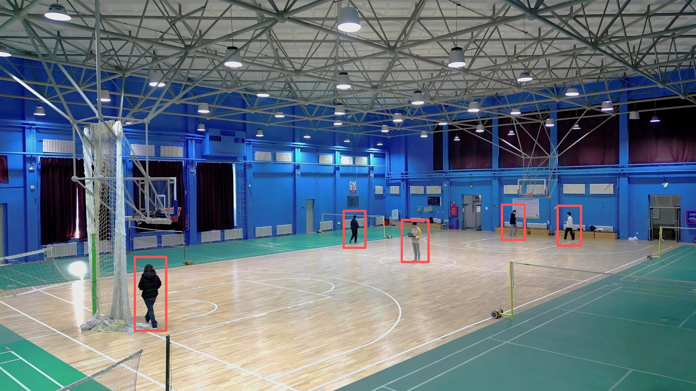
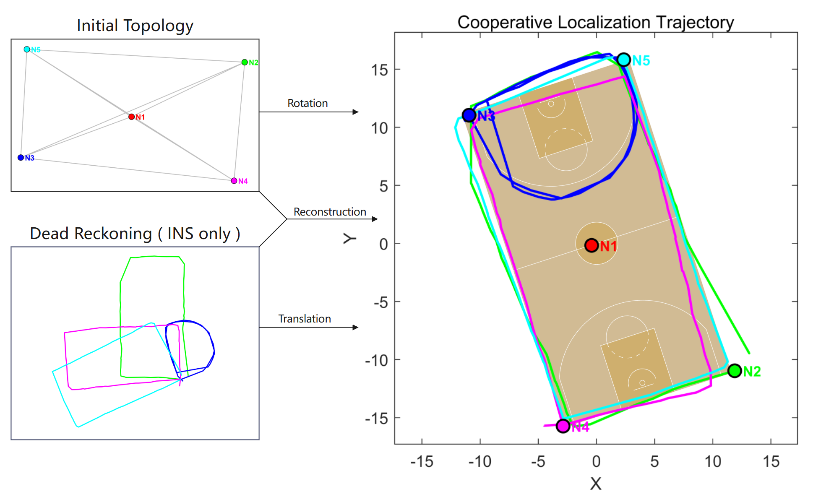

:::note
📄 **IEEE Paper**:  [Anchor-Free Multi-Target Azimuth Auto-Alignment with UWB and IMU](https://ieeexplore.ieee.org/) (IEEE Conference, 2026)
:::

We built a **multi-target cooperative positioning system** that enables a group of users to localize themselves relative to each other in **GNSS-denied environments** (indoor, underground, dense urban) **without any pre-deployed base stations, anchor nodes, or absolute heading references**.

Each user wears two small sensor modules: a **foot-mounted IMU** (BMI088 on ESP32-C6) for pedestrian dead-reckoning, and an **upper-arm-mounted UWB node** (DecaWave DW1000) for inter-node ranging. The system fuses these two data sources to jointly estimate every node's **initial position** and **relative azimuth**, mapping all local trajectories into a unified global coordinate frame.

The system operates under **completely anchor-free conditions** — no base stations, no magnetometers, no prior position information. At startup ($t=0$), **Multidimensional Scaling (MDS)** analytically recovers the relative spatial topology from UWB distance measurements alone. As users begin to move ($t>0$), a **spatiotemporal optimization** jointly solves for global rotation and individual node azimuths while a **dual-branch parallel strategy** eliminates mirror ambiguity — the correct configuration yields residuals **several orders of magnitude smaller** than the incorrect mirror solution.

Field tests were conducted on a **real hardware platform**. The UWB module achieves a typical ranging accuracy of **$5\text{--}20\,\text{cm}$** via Double-Sided Two-Way Ranging. The foot-mounted IMU provides robust local displacement increments through **ZUPT** (Zero Velocity Update) to suppress cumulative drift.

The experiment took place on a **$28\,\text{m}\times15\,\text{m}$ indoor basketball court** with **5 subjects** performing straight-line walking, right-angle turns, circular loops, and irregular maneuvers. The five nodes started from scattered positions with **random initial orientations** — **no base stations or preset position information was available**.

Throughout data collection, each node's foot-mounted module independently ran INS algorithms. Displacement data and UWB ranging were aggregated at the master node, and after removing NLOS outliers, a multi-epoch observation sequence was constructed for reconstruction.

The results demonstrate that the algorithm **successfully reconstructed continuous multi-node trajectories** under real sensor noise, synchronization errors, and complex motion patterns — providing an **autonomous initialization scheme** for multi-device cooperative navigation in GNSS-denied environments.

:::note
📄 **Paper**: [Anchor-Free Multi-Target Azimuth Auto-Alignment with UWB and IMU](https://ieeexplore.ieee.org/) — IEEE Conference, 2026
:::note