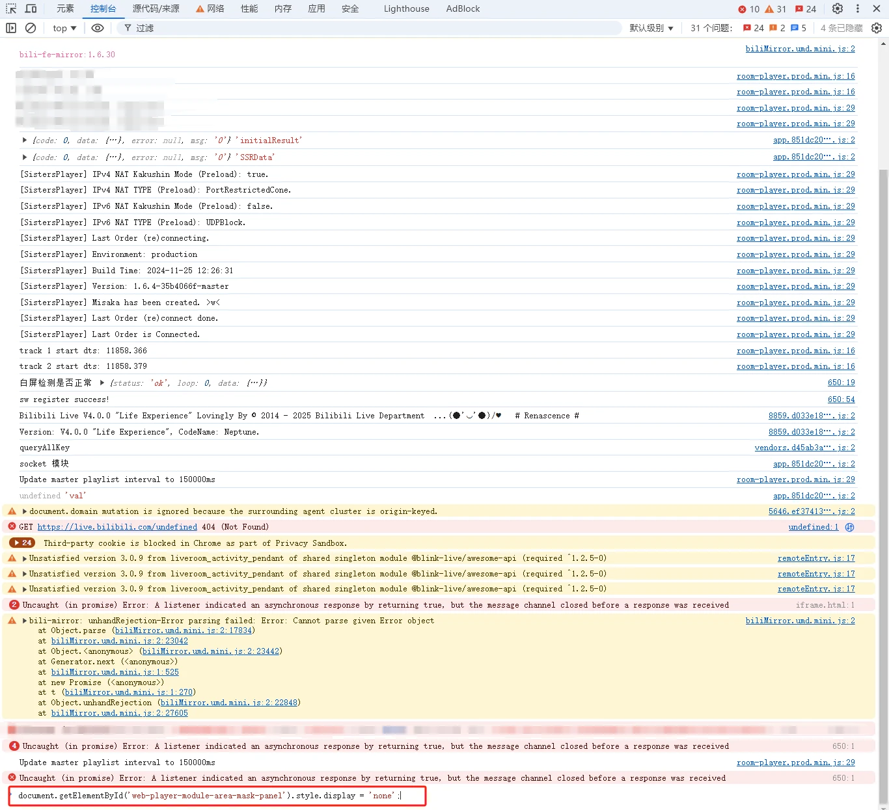
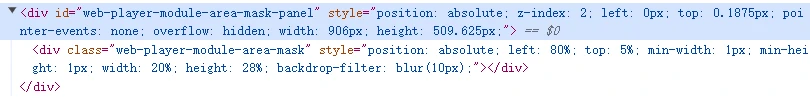
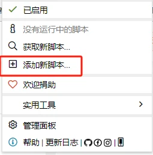

> ⚠️ **注意**：该方法仅适用于电脑端，手机暂时没有方法删除。

---

## 🧰 四种解决方法

### 方法一 🚀 Console 一键隐藏

按 `F12` 打开**控制台（Console）**，输入以下内容并回车：

```javascript
document.getElementById('web-player-module-area-mask-panel').style.display = 'none';
```



✅ **最快速** — 无需安装任何东西，一次管一次。

---

### 方法二 🎯 元素删除法

按 `F12` 打开**元素面板（Element）**，找到以下节点：



按 `Delete` 键删除即可。

---

### 方法三 📦 使用现成油猴脚本

**Bilibili Live Tasks Helper**

🔗 https://greasyfork.org/zh-CN/scripts/406048-bilibili-live-tasks-helper

> *（如何安装油猴插件请自行搜索 🔍）*

可能是本人水平不够，没有找到脚本的配置入口，于是自己写了一个…👇



---

### 方法四 ✍️ 自建油猴脚本

如果现成脚本不好用，可以自己动手创建一个新的油猴脚本，然后把下面的代码复制进去就行啦 ✨

```javascript
// ==UserScript==
// @name        Modify Style for Bilibili Player
// @namespace   http://tampermonkey.net/
// @version     1.0
// @description Modify the style attribute of .web-player-module-area-mask on live.bilibili.com
// @author      Anonymous
// @match       https://live.bilibili.com/*
// @grant       none
// ==/UserScript==

(function() {
  'use strict';

  // Function to modify the style of the target elements
  function modifyStyle() {
    var elements = document.querySelectorAll('.web-player-module-area-mask');
    elements.forEach(function(element) {
      element.style = '';
    });
  }

  // Use a MutationObserver to watch for changes in the DOM
  var observer = new MutationObserver(function(mutations) {
    mutations.forEach(function(mutation) {
      if (mutation.addedNodes.length) {
        // Check if the target element is in the added nodes
        var targetElement = Array.from(mutation.addedNodes).find(
          node => node.classList && node.classList.contains('web-player-module-area-mask')
        );
        if (targetElement) {
          modifyStyle();
        }
      }
    });
  });

  // Start observing the document body for added nodes
  observer.observe(document.body, {
    childList: true,
    subtree: true
  });

  // Also modify existing elements on script load
  modifyStyle();
})();
```